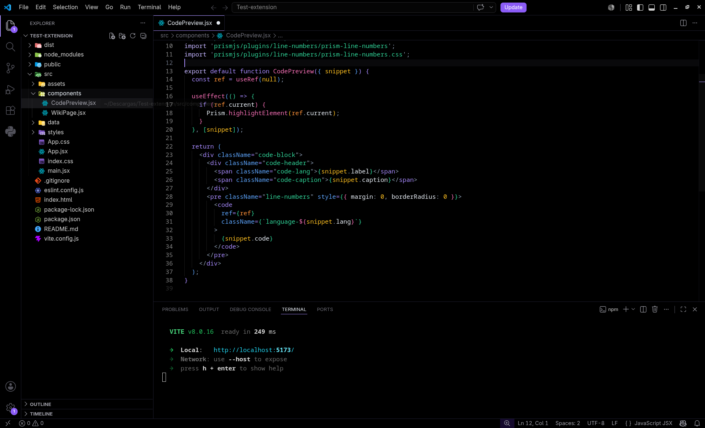
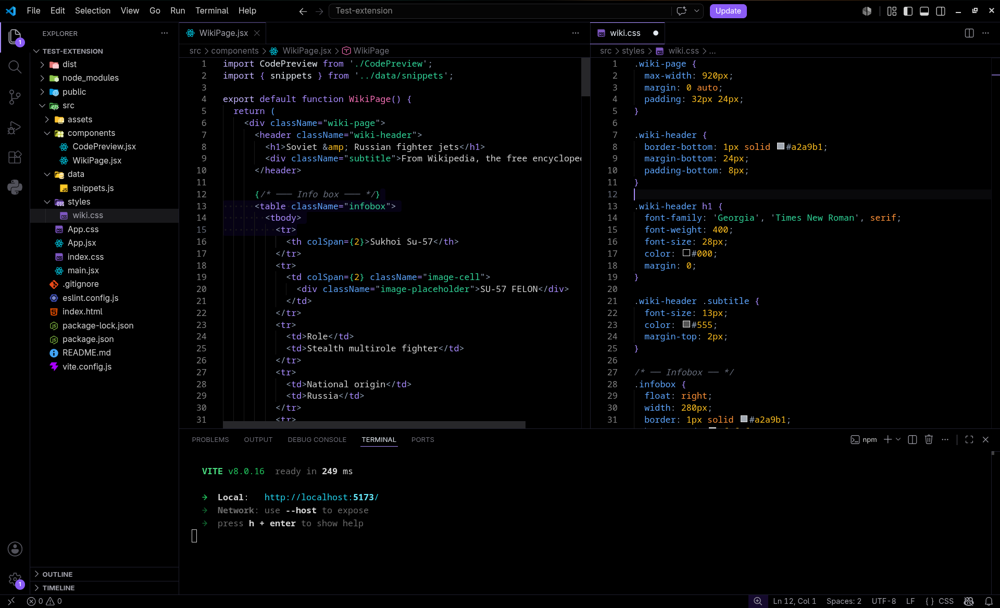
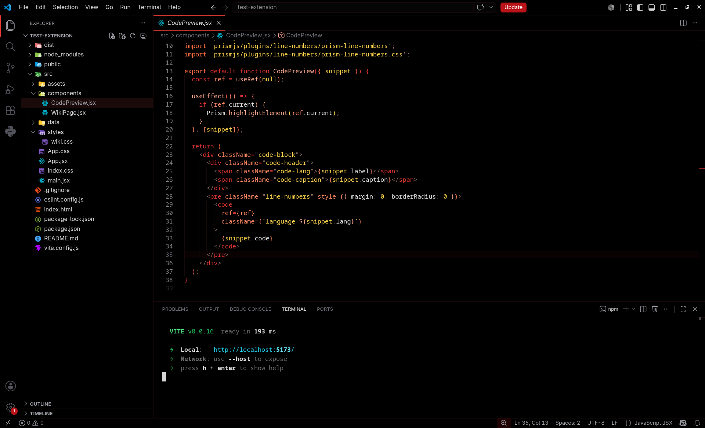
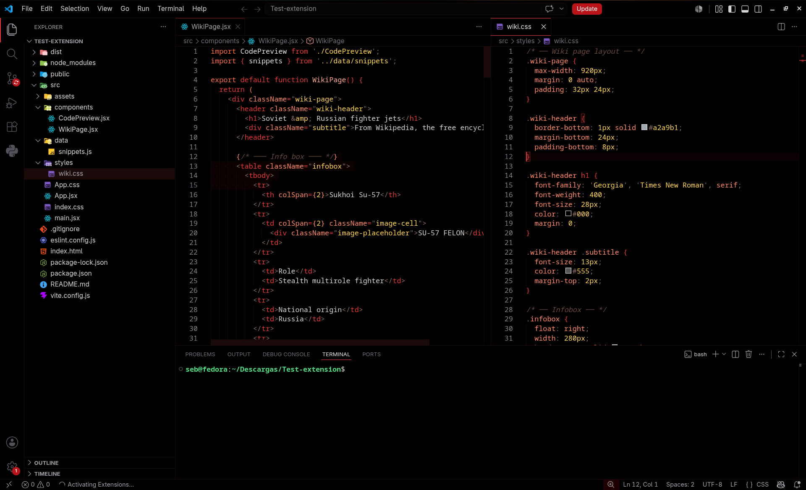

# PureDark OLED Theme

A pure black OLED-friendly theme for Visual Studio Code, designed for dark environments and OLED displays.

## Features

- Pure black background (`#000000`)
- Amethyst purple and Akatsuki red accent colors
- Minimal and clean visual style
- Designed for OLED screens and low-light coding

## Preview
##### Purple Design
<p align="center">
  
</p>
<p align="center">
  
</p>

##### Akatsuki Design
<p align="center">
  
</p>
<p align="center">
  
</p>

## Installation

1. Open Visual Studio Code.
2. Go to Extensions.
3. Search for `PureDark OLED Theme`.
4. Install and select the theme.

## Recommended settings

```json
{
  "workbench.colorTheme": "PureDark OLED Theme"
}
```

## Repository

Source code is available on GitHub:
https://github.com/Sebithaz-dev/PureDark-Oled-Theme